  <h1 style="font-size: 2.5em; text-shadow: 3px 3px #2e86de;">Bill's GitHub Profile</h1>
  

  ## 🌐 Connect with Me
  

    
    
    
    
    
  

  ---

  ## 💻 Tech Stack
  

    
    
    
    
    
    
    
    
    
    
    
    
    
    
    
    
  

  ---

  ## 📊 GitHub Stats

  <!-- Stats & Top Languages: auto-generated SVGs stored in profile/ folder via GitHub Actions -->
  
   
  
   
  

  <!-- Snake Animation: auto-generated via GitHub Actions -->
  <picture>
    <source media="(prefers-color-scheme: dark)" srcset="./profile/github-snake-dark.svg">
    <source media="(prefers-color-scheme: light)" srcset="./profile/github-snake.svg">
    
  </picture>

  ## 🏆 GitHub Trophies
  

  ## ✍️ Random Dev Quote
  

