

# Bill Truong · Bill The Dev

**Unity Engineer · Games, XR & Tools** · [billthedev.com](https://www.billthedev.com) · [Play my games](https://billtruong003.itch.io/) · [Download CV](https://www.billthedev.com/Bill_Resume.pdf)

<!-- AWAKEN:START -->
<!-- Generated by git-profile-awaken. Edit awaken.json instead of this block. -->

<picture><source media="(prefers-color-scheme: dark)" srcset="awaken/banner-dark.svg"><source media="(prefers-color-scheme: light)" srcset="awaken/banner-light.svg">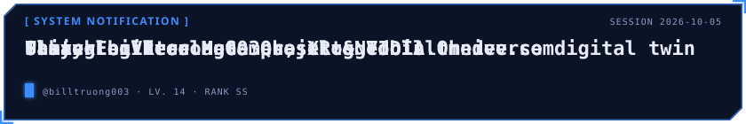</picture>

<picture><source media="(prefers-color-scheme: dark)" srcset="awaken/hunter-dark.svg"><source media="(prefers-color-scheme: light)" srcset="awaken/hunter-light.svg">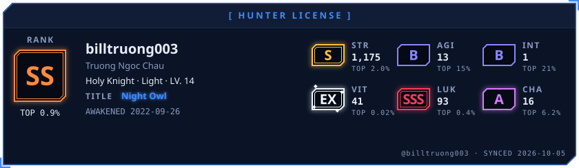</picture>

<picture><source media="(prefers-color-scheme: dark)" srcset="awaken/bio-dark.svg"><source media="(prefers-color-scheme: light)" srcset="awaken/bio-light.svg">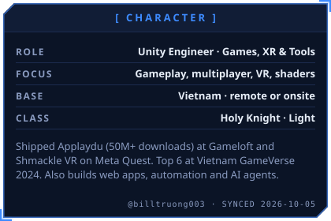</picture>
<a href="https://www.billthedev.com/Bill_Resume.pdf"><picture><source media="(prefers-color-scheme: dark)" srcset="awaken/career-dark.svg"><source media="(prefers-color-scheme: light)" srcset="awaken/career-light.svg">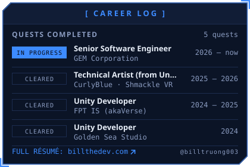</picture></a>

<a href="https://www.billthedev.com"><picture><source media="(prefers-color-scheme: dark)" srcset="awaken/contact-1-website-dark.svg"><source media="(prefers-color-scheme: light)" srcset="awaken/contact-1-website-light.svg"></picture></a>
<a href="mailto:billtruong003@gmail.com"><picture><source media="(prefers-color-scheme: dark)" srcset="awaken/contact-2-email-dark.svg"><source media="(prefers-color-scheme: light)" srcset="awaken/contact-2-email-light.svg"></picture></a>
<a href="https://www.linkedin.com/in/billtruong003/"><picture><source media="(prefers-color-scheme: dark)" srcset="awaken/contact-3-linkedin-dark.svg"><source media="(prefers-color-scheme: light)" srcset="awaken/contact-3-linkedin-light.svg"></picture></a>
<a href="https://github.com/billtruong003"><picture><source media="(prefers-color-scheme: dark)" srcset="awaken/contact-4-github-dark.svg"><source media="(prefers-color-scheme: light)" srcset="awaken/contact-4-github-light.svg"></picture></a>

<a href="https://www.youtube.com/@BillTheDev"><picture><source media="(prefers-color-scheme: dark)" srcset="awaken/contact-5-youtube-dark.svg"><source media="(prefers-color-scheme: light)" srcset="awaken/contact-5-youtube-light.svg"></picture></a>
<a href="https://www.youtube.com/@BillVRGamer"><picture><source media="(prefers-color-scheme: dark)" srcset="awaken/contact-6-youtube-dark.svg"><source media="(prefers-color-scheme: light)" srcset="awaken/contact-6-youtube-light.svg"></picture></a>
<a href="https://www.youtube.com/@BillAITrainer"><picture><source media="(prefers-color-scheme: dark)" srcset="awaken/contact-7-youtube-dark.svg"><source media="(prefers-color-scheme: light)" srcset="awaken/contact-7-youtube-light.svg"></picture></a>
<a href="https://billtruong003.itch.io/"><picture><source media="(prefers-color-scheme: dark)" srcset="awaken/contact-8-itchdotio-dark.svg"><source media="(prefers-color-scheme: light)" srcset="awaken/contact-8-itchdotio-light.svg"></picture></a>

<a href="https://www.facebook.com/billthedev/"><picture><source media="(prefers-color-scheme: dark)" srcset="awaken/contact-9-facebook-dark.svg"><source media="(prefers-color-scheme: light)" srcset="awaken/contact-9-facebook-light.svg"></picture></a>
<a href="https://instagram.com/bill.workaholic"><picture><source media="(prefers-color-scheme: dark)" srcset="awaken/contact-10-instagram-dark.svg"><source media="(prefers-color-scheme: light)" srcset="awaken/contact-10-instagram-light.svg"></picture></a>
<a href="https://discord.gg/truongngocchau"><picture><source media="(prefers-color-scheme: dark)" srcset="awaken/contact-11-discord-dark.svg"><source media="(prefers-color-scheme: light)" srcset="awaken/contact-11-discord-light.svg"></picture></a>
<a href="https://www.billthedev.com/Bill_Resume.pdf"><picture><source media="(prefers-color-scheme: dark)" srcset="awaken/cv-dark.svg"><source media="(prefers-color-scheme: light)" srcset="awaken/cv-light.svg"></picture></a>

<picture><source media="(prefers-color-scheme: dark)" srcset="awaken/ladder-dark.svg"><source media="(prefers-color-scheme: light)" srcset="awaken/ladder-light.svg">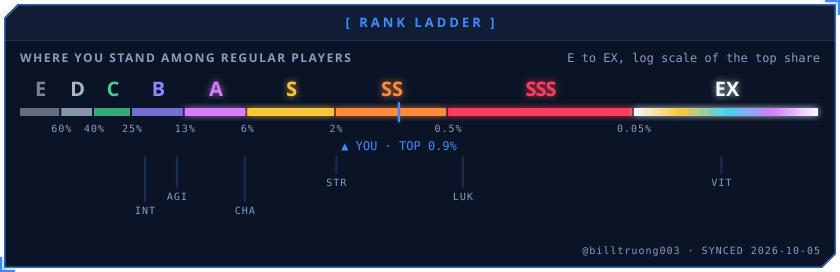</picture>

<picture><source media="(prefers-color-scheme: dark)" srcset="awaken/web-dark.svg"><source media="(prefers-color-scheme: light)" srcset="awaken/web-light.svg">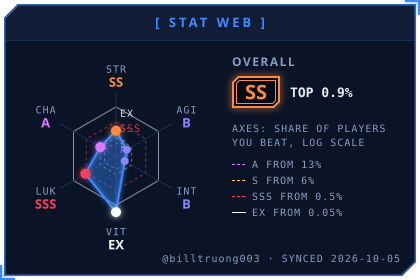</picture>
<picture><source media="(prefers-color-scheme: dark)" srcset="awaken/skills-dark.svg"><source media="(prefers-color-scheme: light)" srcset="awaken/skills-light.svg">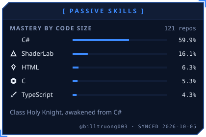</picture>

<picture><source media="(prefers-color-scheme: dark)" srcset="awaken/arsenal-dark.svg"><source media="(prefers-color-scheme: light)" srcset="awaken/arsenal-light.svg">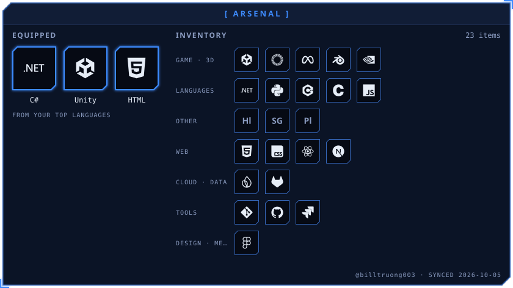</picture>

<a href="https://github.com/billtruong003/KeyStream-Gemini"><picture><source media="(prefers-color-scheme: dark)" srcset="awaken/spotlight-1-dark.svg"><source media="(prefers-color-scheme: light)" srcset="awaken/spotlight-1-light.svg">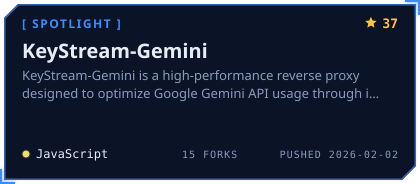</picture></a>
<a href="https://github.com/billtruong003/Bill-SSOutline"><picture><source media="(prefers-color-scheme: dark)" srcset="awaken/spotlight-2-dark.svg"><source media="(prefers-color-scheme: light)" srcset="awaken/spotlight-2-light.svg">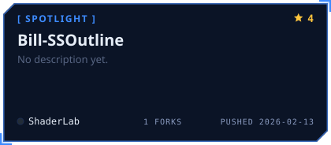</picture></a>

<a href="https://github.com/billtruong003/Bill-Biome-Shader"><picture><source media="(prefers-color-scheme: dark)" srcset="awaken/spotlight-3-dark.svg"><source media="(prefers-color-scheme: light)" srcset="awaken/spotlight-3-light.svg">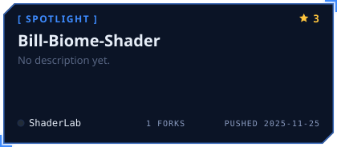</picture></a>
<a href="https://github.com/billtruong003/SceneSwitcherToolUnity"><picture><source media="(prefers-color-scheme: dark)" srcset="awaken/spotlight-4-dark.svg"><source media="(prefers-color-scheme: light)" srcset="awaken/spotlight-4-light.svg">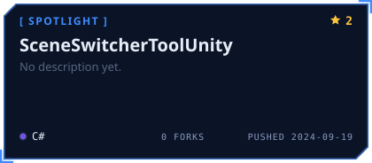</picture></a>

<picture><source media="(prefers-color-scheme: dark)" srcset="awaken/activity-dark.svg"><source media="(prefers-color-scheme: light)" srcset="awaken/activity-light.svg">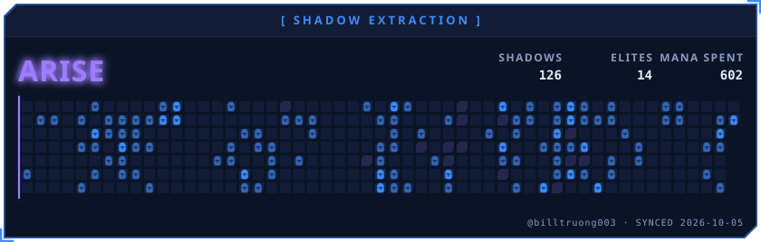</picture>

<a href="https://www.youtube.com/watch?v=azjvdUeRa68"><picture><source media="(prefers-color-scheme: dark)" srcset="awaken/board-dark.svg"><source media="(prefers-color-scheme: light)" srcset="awaken/board-light.svg">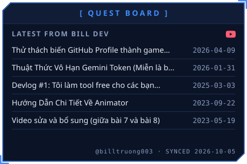</picture></a>
<picture><source media="(prefers-color-scheme: dark)" srcset="awaken/oracle-dark.svg"><source media="(prefers-color-scheme: light)" srcset="awaken/oracle-light.svg"></picture>

<picture><source media="(prefers-color-scheme: dark)" srcset="awaken/daily-dark.svg"><source media="(prefers-color-scheme: light)" srcset="awaken/daily-light.svg">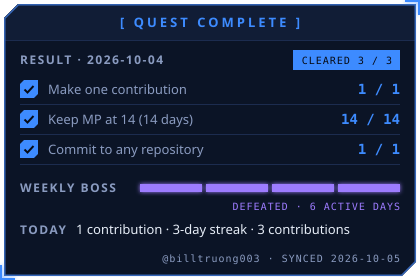</picture>
<picture><source media="(prefers-color-scheme: dark)" srcset="awaken/hours-dark.svg"><source media="(prefers-color-scheme: light)" srcset="awaken/hours-light.svg">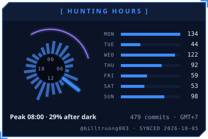</picture>

<picture><source media="(prefers-color-scheme: dark)" srcset="awaken/contribution-dark.svg"><source media="(prefers-color-scheme: light)" srcset="awaken/contribution-light.svg">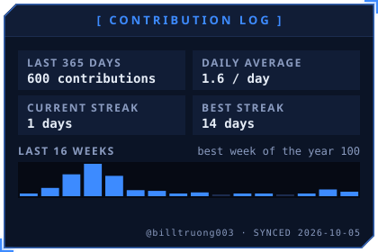</picture>
<picture><source media="(prefers-color-scheme: dark)" srcset="awaken/combat-dark.svg"><source media="(prefers-color-scheme: light)" srcset="awaken/combat-light.svg">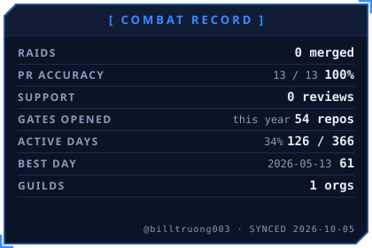</picture>

<picture><source media="(prefers-color-scheme: dark)" srcset="awaken/achievements-dark.svg"><source media="(prefers-color-scheme: light)" srcset="awaken/achievements-light.svg">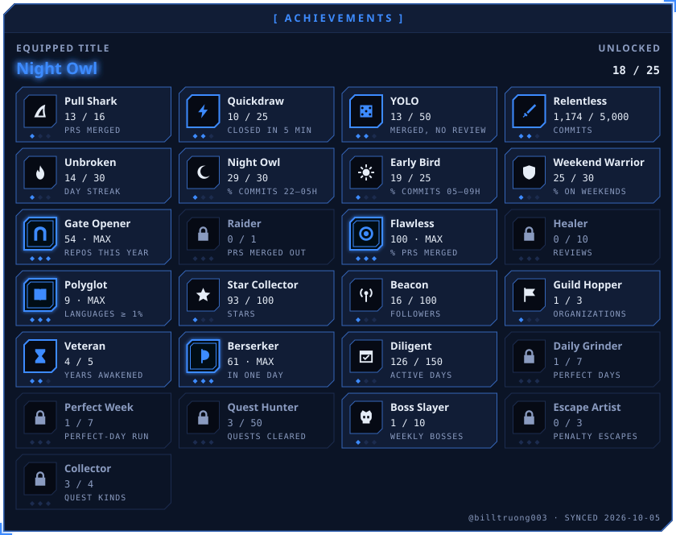</picture>

<picture><source media="(prefers-color-scheme: dark)" srcset="awaken/rune-str-dark.svg"><source media="(prefers-color-scheme: light)" srcset="awaken/rune-str-light.svg">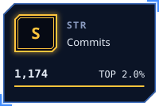</picture>
<picture><source media="(prefers-color-scheme: dark)" srcset="awaken/rune-agi-dark.svg"><source media="(prefers-color-scheme: light)" srcset="awaken/rune-agi-light.svg">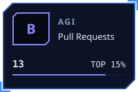</picture>
<picture><source media="(prefers-color-scheme: dark)" srcset="awaken/rune-int-dark.svg"><source media="(prefers-color-scheme: light)" srcset="awaken/rune-int-light.svg"></picture>
<picture><source media="(prefers-color-scheme: dark)" srcset="awaken/rune-vit-dark.svg"><source media="(prefers-color-scheme: light)" srcset="awaken/rune-vit-light.svg">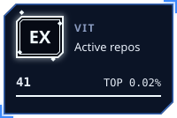</picture>

<picture><source media="(prefers-color-scheme: dark)" srcset="awaken/rune-luk-dark.svg"><source media="(prefers-color-scheme: light)" srcset="awaken/rune-luk-light.svg">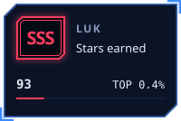</picture>
<picture><source media="(prefers-color-scheme: dark)" srcset="awaken/rune-cha-dark.svg"><source media="(prefers-color-scheme: light)" srcset="awaken/rune-cha-light.svg">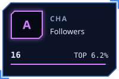</picture>

<!-- AWAKEN:END -->

Drawn every night by <a href="https://git-profile-awaken.vercel.app">Git Profile Awaken</a>. Ranks are percentiles among regular GitHub players.

